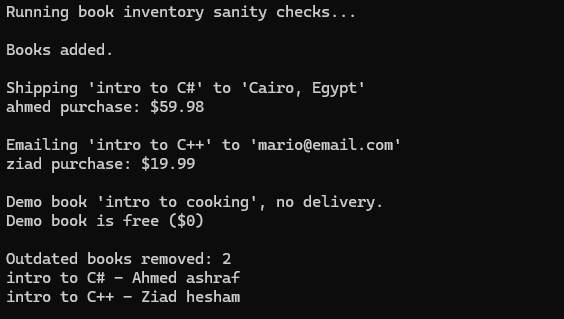
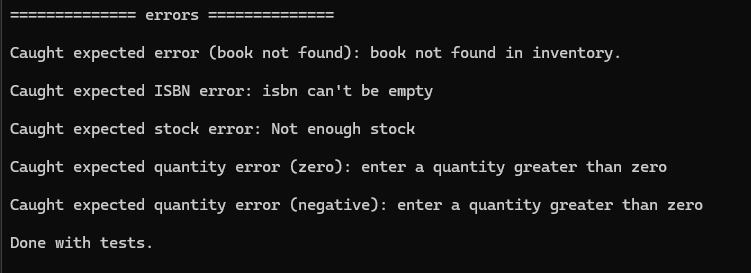

# Quantum Bookstore System

A simple online bookstore built in C# that manages different types of books and handles deliveries.

## What It Does

This bookstore can handle three types of books:
- **Paper Books** - Physical books that get shipped to your address
- **EBooks** - Digital books sent to your email as files (PDF, DOCX, etc.)
- **Demo Books** - Free sample books for browsing (no delivery needed)

Each book type knows how to deliver itself - paper books automatically use shipping, ebooks use email, and demo books don't need delivery at all.

## Key Features

- Add books to your inventory with details like ISBN, title, author, and price
- Buy books with automatic delivery to email or address
- Track stock for physical books 
- Remove old books that are past their prime
- Handle errors gracefully (like trying to buy books that don't exist)

## Design Patterns

### Strategy Pattern
Instead of writing messy if-else statements for different delivery types, I used the Strategy Pattern. Each book type picks its own delivery method:
- `EmailService` for digital books
- `ShippingService` for physical books  
- `NoDelivery` for demo books

## SOLID Principles

The code follows good programming practices:
- **Single Responsibility** - Each class does one thing well
- **Open/Closed** - Easy to add new book types without changing existing code
- **Interface Segregation** - Small, focused interfaces that make sense
- **Dependency Inversion** - Classes depend on interfaces, not concrete implementations

## Test Results

## Error Handling

The system catches and handles common problems like:
- Invalid book information (empty titles, negative prices, future dates)
- Trying to buy books that don't exist
- Not enough stock for physical books
- Missing email or delivery address
- Invalid quantities

## Getting Started

1. Clone the repository
2. Open in Visual Studio
3. Build and run the project
4. Check the console for test results

---

*Built for the Fawry N² Dev Slope #10 Challenge*
